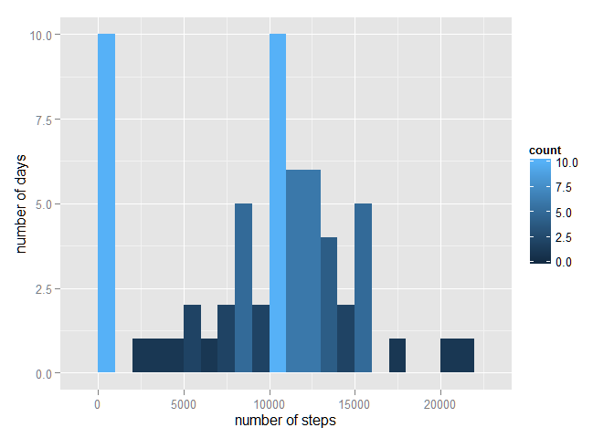

# Reproducible Research: Peer Assessment 1


## Loading and preprocessing the data
      1. Fork the assignement from rdpeng/RepData_PeerAssessment1 to my github account
      2. Clone it in my PC
      3. set working directory to the cloned directory:

```r
      getwd()
```

```
## [1] "C:/Users/TAY/Documents/Coursera/RepData_PeerAssessment1"
```
      4. Load load the data into a data frame from activity.csv (compressed in activity.zip)

```r
      activitydf<-read.csv(unz("activity.zip", filename = "activity.csv"), na.strings = "NA")
      summary(activitydf)
```

```
##      steps                date          interval     
##  Min.   :  0.00   2012-10-01:  288   Min.   :   0.0  
##  1st Qu.:  0.00   2012-10-02:  288   1st Qu.: 588.8  
##  Median :  0.00   2012-10-03:  288   Median :1177.5  
##  Mean   : 37.38   2012-10-04:  288   Mean   :1177.5  
##  3rd Qu.: 12.00   2012-10-05:  288   3rd Qu.:1766.2  
##  Max.   :806.00   2012-10-06:  288   Max.   :2355.0  
##  NA's   :2304     (Other)   :15840
```


## What is mean total number of steps taken per day?

      1. Calculate the total number of steps taken per day ( ignoring the missing values in the dataset!)

```r
      sumStepsbyDay<-aggregate(activitydf$steps, by = list(activitydf$date), FUN = "sum", na.rm = TRUE)
      names(sumStepsbyDay) = c("date", "nsteps")
      head(sumStepsbyDay)
```

```
##         date nsteps
## 1 2012-10-01      0
## 2 2012-10-02    126
## 3 2012-10-03  11352
## 4 2012-10-04  12116
## 5 2012-10-05  13294
## 6 2012-10-06  15420
```
      2. Histogram of the total number of steps taken each day

```r
      require(ggplot2, quietly = TRUE)
      p <- ggplot(sumStepsbyDay, aes(x=nsteps))
      p <- p + geom_histogram(binwidth=1000, aes(fill = ..count..))
      p <- p + labs(x = "number of steps", y = "number of days")
      print(p)
```

 
      
      3. Calculate and report the mean and median of the total number of steps taken per day
      

```r
      meanstepsperday<-mean(sumStepsbyDay$nsteps)
      meanstepsperday
```

```
## [1] 9354.23
```

```r
      medianstepsperday<-median(sumStepsbyDay$nsteps)
      medianstepsperday
```

```
## [1] 10395
```


## What is the average daily activity pattern?
      1. Make a time series plot (i.e. type = "l") of the 5-minute interval (x-axis) and the average number of steps taken, averaged across all days (y-axis)

```r
      meanStepsby5min<-aggregate(activitydf$steps, by = list(activitydf$interval), 
                                 FUN = "mean", na.rm = TRUE)
      names(meanStepsby5min)=c("interval", "meansteps")
      meanStepsby5min$interval <- strptime(sprintf("%04.f", meanStepsby5min$interval), "%H%M")
      p<-ggplot(meanStepsby5min, aes(x=interval, y=meansteps))
      p<-p+geom_line()
      p <- p + labs(x = "time of the day", y = "mean number of steps")
      print(p)
```

 
      
      2. maximum number of steps in a 5-minute interval on average across all the days in the dataset

```r
      subset(meanStepsby5min, meanStepsby5min$meansteps == max(meanStepsby5min$meansteps))
```

```
##                interval meansteps
## 104 2015-10-10 08:35:00  206.1698
```
      

## Imputing missing values

      1. Total number of missing values in the dataset

```r
      sum(is.na(activitydf$steps))
```

```
## [1] 2304
```
      2. strategy for filling in all of the missing values in the dataset:
            2.1 Remove the days with NA's
            2.2 Calculate the average for every 5 min
            2.3 Substitute NA's with these averages

```r
      NAdays<-unique(subset(activitydf$date, is.na(activitydf$steps)))
      filteredData<-subset(activitydf, !activitydf$date %in% NAdays)
      fmeanStepsby5min<-aggregate(filteredData$steps, by = list(filteredData$interval), 
                                 FUN = "mean")
      names(fmeanStepsby5min)=c("interval", "meansteps")
      ndays=length(unique(activitydf$date))
      nfdays=length(unique(filteredData$date))
      newactivitydf<-activitydf
      newactivitydf$extra<-rep(fmeanStepsby5min$meansteps, ndays)
      newactivitydf$steps<-ifelse(is.na(newactivitydf$steps),newactivitydf$extra,newactivitydf$steps)
      newactivitydf<-newactivitydf[,1:3]
```
      **There are 61 days in the original data set. Once filtered 53 remain.**
      
      3. New dataset that is equal to the original dataset but with the missing data filled in

```r
      head(newactivitydf)
```

```
##       steps       date interval
## 1 1.7169811 2012-10-01        0
## 2 0.3396226 2012-10-01        5
## 3 0.1320755 2012-10-01       10
## 4 0.1509434 2012-10-01       15
## 5 0.0754717 2012-10-01       20
## 6 2.0943396 2012-10-01       25
```


## Are there differences in activity patterns between weekdays and weekends?

      1. Histogram of the total number of steps taken each day with the new data set.

```r
      nsumStepsbyDay<-aggregate(newactivitydf$steps, by = list(newactivitydf$date), 
                                FUN = "sum", na.rm = TRUE)
      names(nsumStepsbyDay) = c("date", "nsteps")
      nmeanstepsperday<-mean(nsumStepsbyDay$nsteps)
      nmedianstepsperday<-median(nsumStepsbyDay$nsteps)
      p <- ggplot(nsumStepsbyDay, aes(x=nsteps))
      p <- p + geom_histogram(binwidth=1000, aes(fill = ..count..))
      p <- p + labs(title = "New data set", x = "number of steps", y = "number of days")
      print(p)
```

 

      2. Comparison of results with the new data set:
            **The mean steps per day go from 9354 to 10766** 
            **The median steps per day go from 10395 to 10766** 


```r
      sumStepsbyDay$date <- strptime(sumStepsbyDay$date, "%Y-%m-%d")
      nsumStepsbyDay$date <- strptime(nsumStepsbyDay$date, "%Y-%m-%d")
      p<-ggplot()
      p<-p+geom_line(data=sumStepsbyDay, aes(x=date, y=nsteps, color="original"))
      p<-p+geom_line(data=nsumStepsbyDay, aes(x=date, y=nsteps, color="new"), size=2)
      p<-p+ scale_colour_manual(values = c("green", "red"))
      p<-p+ theme(legend.title=element_blank())
      p <- p + labs(x = "", y = "number of steps")
      print(p)
```

 

      3. Comparison between activity in weekdays and weekends:


```r
      newactivitydf$weekday<-ifelse(as.POSIXlt(newactivitydf$date)$wday %in% c(0,6),
                                    "weekend", "weekday")
      meanstepsbyweekday<-aggregate(newactivitydf$steps, 
                          by=list(newactivitydf$interval, newactivitydf$weekday), 
                          FUN="mean",na.rm=TRUE)
      names(meanstepsbyweekday)<- c("interval", "weekday", "meansteps")
      p<-ggplot(data=meanstepsbyweekday, aes(x=interval, y=meansteps))
      p<-p+geom_line()
      p<-p+facet_wrap(~weekday, ncol=1)
      print(p)
```

 
